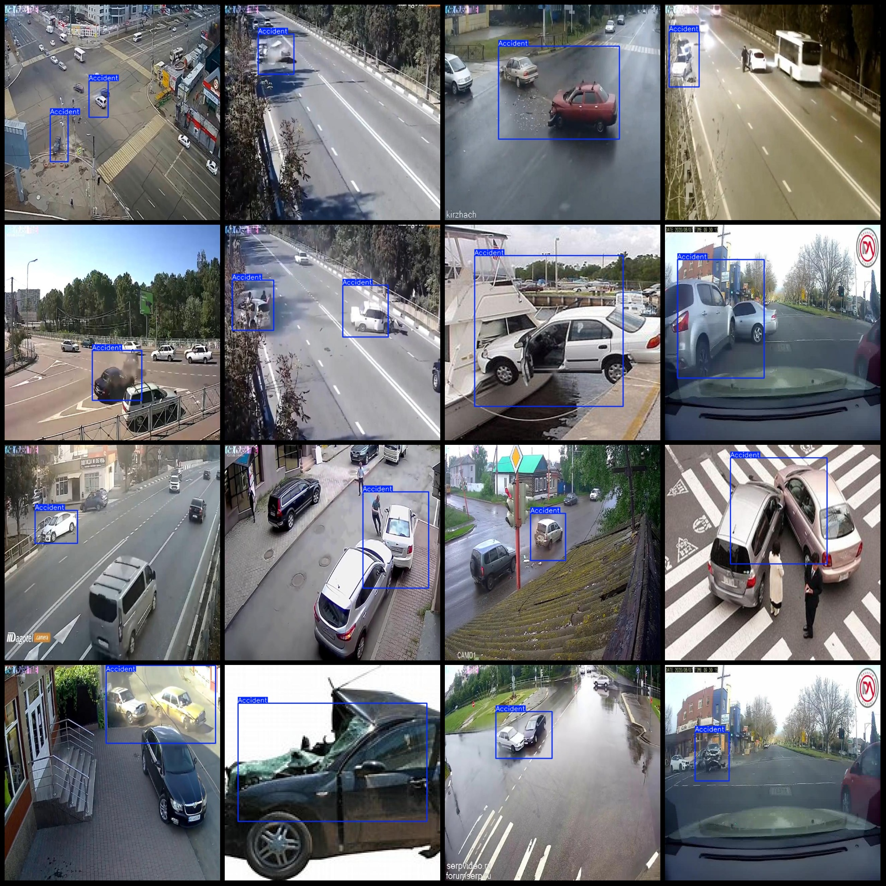
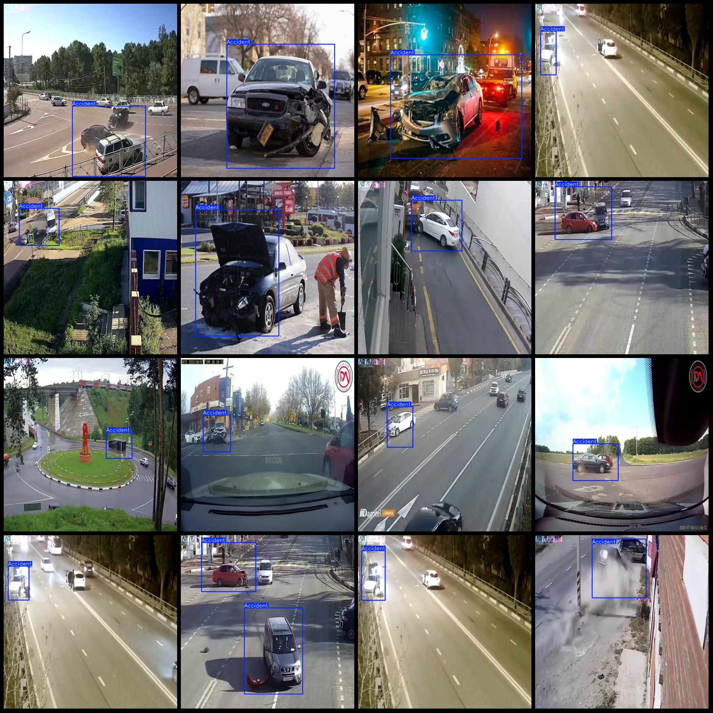

# Intelligent Traffic Highway Road Traffic Accident Detection Data Set VOC+YOLO Format 1741 Images with 1 Category

Dataset format: Pascal VOC format + YOLO format (without split path in the txt file, only containing jpg images and corresponding VOC format xml files and yolo format txt files)
Number of images (jpg file count): 1741
Number of annotations (xml file count): 1741
Number of annotations (txt file count): 1741
Number of annotation categories: 1
Annotation category name: ["Accident"]
Number of bounding box per category:
Accident = 1933
Total bounding box count: 1933
Number of images per category:
Accident = 1741
Image resolution: 640x640
Annotation tool used: labelImg
Annotation rules: draw a bounding box for each category
Important note: The dataset does not have been split into training, validation, or testing sets. You need to divide it yourself.
Special declaration: This dataset does not guarantee the accuracy of the trained models or weight files.
Image preview:
Annotation example:

Image

Here is a pay link on Stripe ( https://buy.stripe.com/3cs8yP7sY87d0vu9AB ). Please contact me lonlonago@foxmail.com after funding $89, and I will send you a complete data files , thank you!

